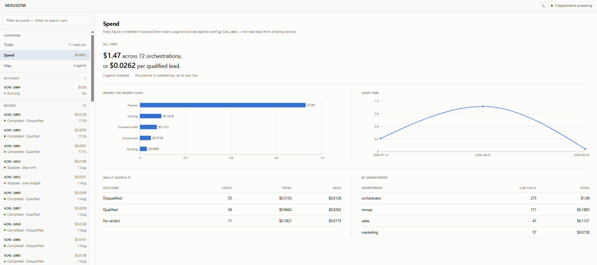
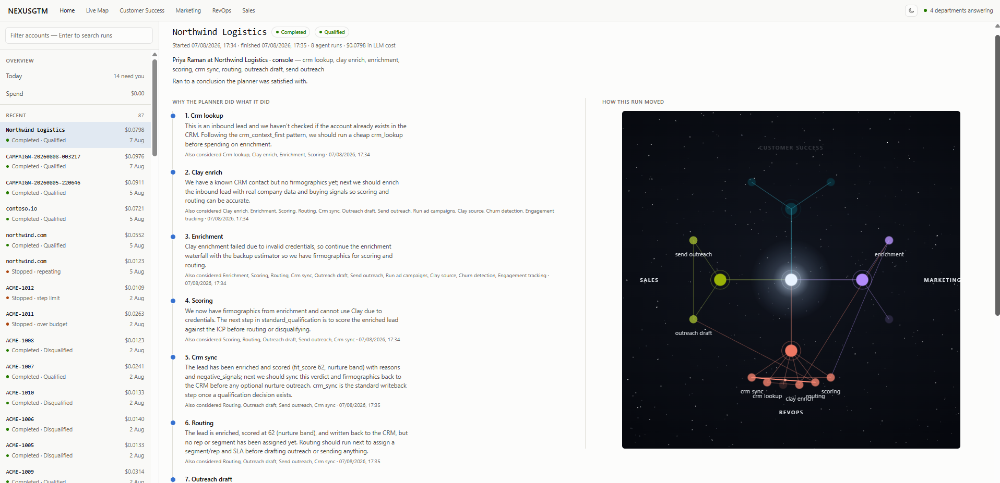
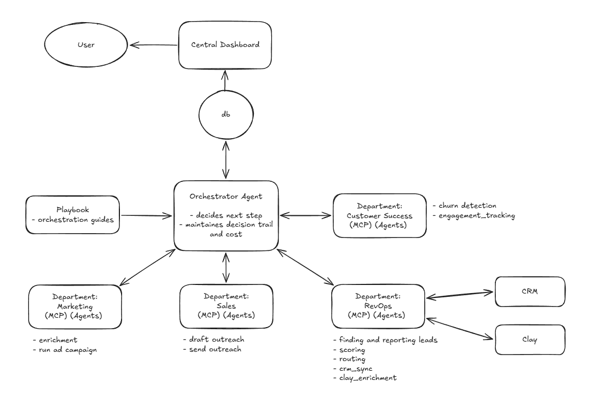

# NexusGTM — Observable GTM Agent Orchestration

NexusGTM is a full GTM solution built on an agent orchestration layer. Departments
(Marketing, RevOps, Sales, etc) run agents that hand work across department boundaries, and
a goal-directed planner sits at the center of that layer, picking the next agent at runtime
from a config-driven registry — bringing real-time flexibility and decision making to every
orchestration.

Because the path is decided at runtime, the work needs to be observable. That is what the
dashboard is for: live runs as they execute, every agent across every department, each
cross-departmental hand-off, and the LLM cost attached to it — per agent, per run, per
orchestration. Built for leadership: what the agents are doing, how work moves between
departments, and what it costs.




## Architecture



| Piece | What it does |
|---|---|
| `core/llm.py` | The only place a provider SDK is touched. Returns text **and** token usage. |
| `core/costmeter.py` | Attributes LLM cost to the agent that spent it; rolls it up. |
| `core/agent.py` | Agent contract + the helper that exposes an agent as an MCP tool. |
| `core/registry.py` | Loads `departments.yaml`, discovers tools — the planner's action space. |
| `core/planner.py` | Renders the playbook into the prompt; returns the next routing decision. |
| `core/orchestrator.py` | LangGraph graph: plan → invoke → guardrails → plan. |
| `store/` | SQLite (WAL). Orchestrations, runs, cost events, decisions. Also the knowledge base. |
| `api/` + `dashboard/` | FastAPI JSON API, React control plane. |

New departments plug in without touching `/core`.

Example path:

```
Marketing            RevOps                     Sales
  enrichment    →    scoring → routing     →    outreach_draft
```

The path above is the *common* one, not a hardcoded sequence. A pre-enriched lead skips
enrichment; a disqualified lead terminates after scoring and never reaches Sales.

### Cost is computed in-process, not read back from a tracing service

The source design sourced all cost from LangSmith. That cannot work: LangSmith ingests
traces asynchronously, so the numbers are not available when the mid-run budget guardrail
needs them. Langfuse is worse for this — it computes cost server-side at ingestion and
exposes nothing on the local span.

So `llm_call` reads `response.usage` — which the Responses API returns inline and
synchronously — and prices it from the table in `config/llm.yaml`. LangSmith stays on as
the trace/debug surface via `wrap_openai`. It is not the system of record for cost.

Cost crosses the MCP process boundary in the tool result: every tool returns
`{output, status, cost_events[]}` and the orchestrator records them. Departments hold no
database handle.

The planner is an LLM call too, so its spend is metered as `orchestrator/planner`. It
belongs to no single run, which is why `orchestrations.total_cost_usd` sums `cost_events`
rather than `runs.cost_usd` — rolling up the runs would silently under-report every
orchestration.

## Setup

```bash
uv venv --python 3.12
uv pip install -e .
uv pip install --group dev                    # pytest et al

# note: `.[dev]` does not work -- dev is a PEP 735 dependency-group, not an extra

cp .env.example .env                          # add your OPENAI_API_KEY

cd dashboard && npm install && cd ..
```

## Running

Five processes, each in its own terminal. The department servers must be up before the
API, or the registry starts with a partial action space (it will name what is missing).

One venv serves all four Python processes — activate it in each terminal:

```powershell
.venv\Scripts\Activate.ps1        # PowerShell
source .venv/Scripts/activate     # Git Bash
```

```bash
python -m departments.marketing.server        # :8101
python -m departments.revops.server           # :8102
python -m departments.sales.server            # :8103

python -m uvicorn api.main:app --port 8000    # :8000
cd dashboard && npm run dev                   # :5173  (Node — no venv needed)
```

Or skip activation and call the interpreter directly:
`.venv/Scripts/python.exe -m departments.marketing.server`.

> Config is cached per process. Editing `config/playbook.yaml` — the ICP, the score
> bands, the negative signals — means restarting the department servers too, not just
> the API, since the revops agents render those values into their prompts.

Then seed some runs and open <http://localhost:5173>:

```bash
python scripts/seed.py
```

The three seeded leads are deliberate — a standard one, a pre-enriched one, and a
free-email-domain one — so the dashboard shows three different decision trails from the
same code.

> The Vite dev server binds to `localhost`, not `127.0.0.1`. Use the former.

## Extending

Adding a department is a server plus three lines of config. Nothing under `/core` or
`/dashboard` changes; the dashboard taxonomy is built from the registry.

1. Stand up a FastMCP server whose agents subclass `core.agent.Agent` and are exposed
   with `core.agent.register`.
2. Add it to `config/departments.yaml`:

```yaml
  - id: customer_success
    name: Customer Success
    mcp_endpoint: http://127.0.0.1:8104/mcp
```

Its tools enter the planner's action space on the next discovery.

Changing *how* the planner works is `config/playbook.yaml` — a goal, patterns described as
guidance, and thresholds. It is rendered into the prompt as text, never parsed into a graph;
parsing it into branch logic would make it the fixed sequence this design exists to avoid.

## Guardrails

Every run is bounded. The table is in `core/orchestrator.py`:

| Condition | Result |
|---|---|
| spend exceeds `budget_usd` | `halted_budget` |
| step count exceeds `max_steps` | `halted_steps` |
| same agent, same input, twice | `halted_loop` |
| payload fails the agent's schema | fed back to the planner as an observation |
| tool error | retry, then re-plan, then halt |
| no suitable agent | `no_agent` |

Schema failures are fed back rather than raised on purpose: the planner's action space is
every registered agent, so it *will* sometimes pick one the blackboard cannot satisfy.
That is a re-plan, not a crash.

## Tests

```bash
pytest
```

Covers the cost rollups, the budget halt, loop detection, the step ceiling, invalid-payload
re-planning, and the decision trail. `core.llm.llm_call` is monkeypatched — no network, no
API key.
