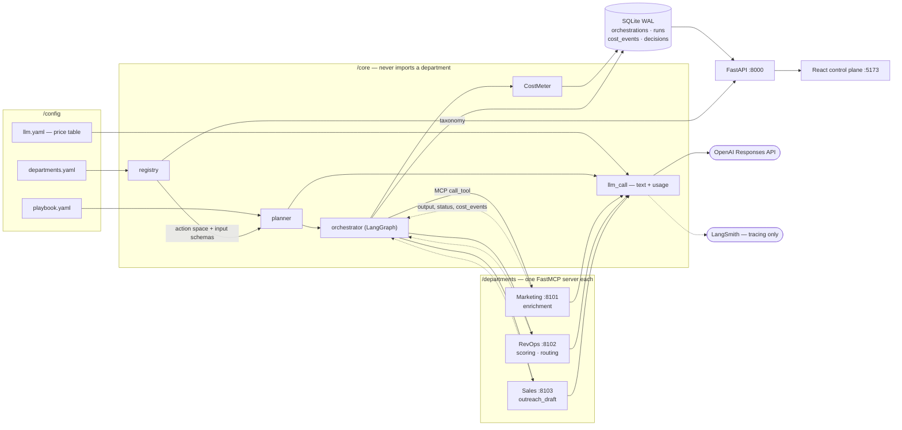
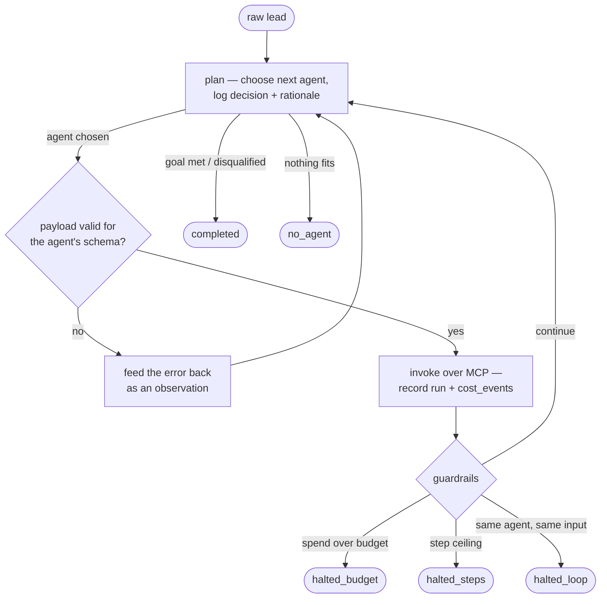
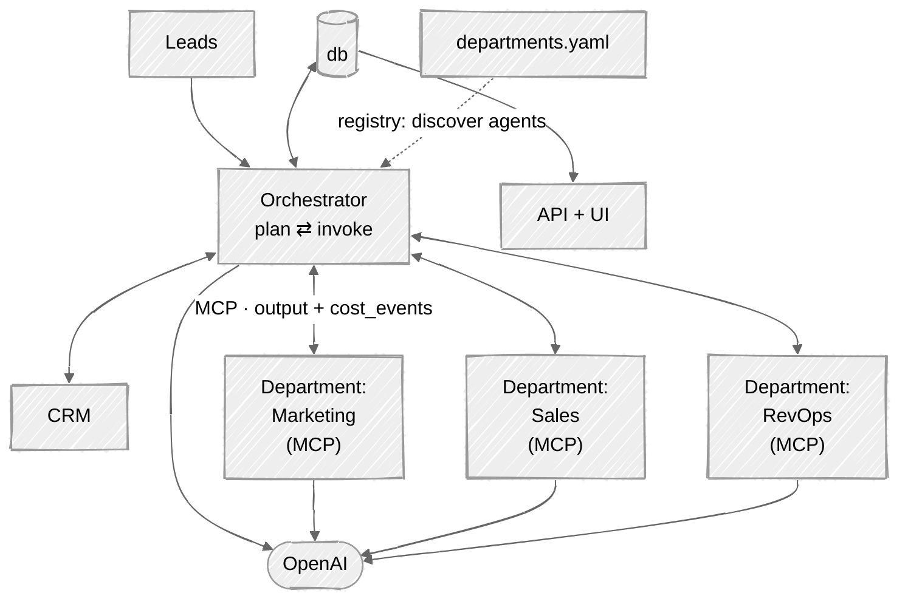
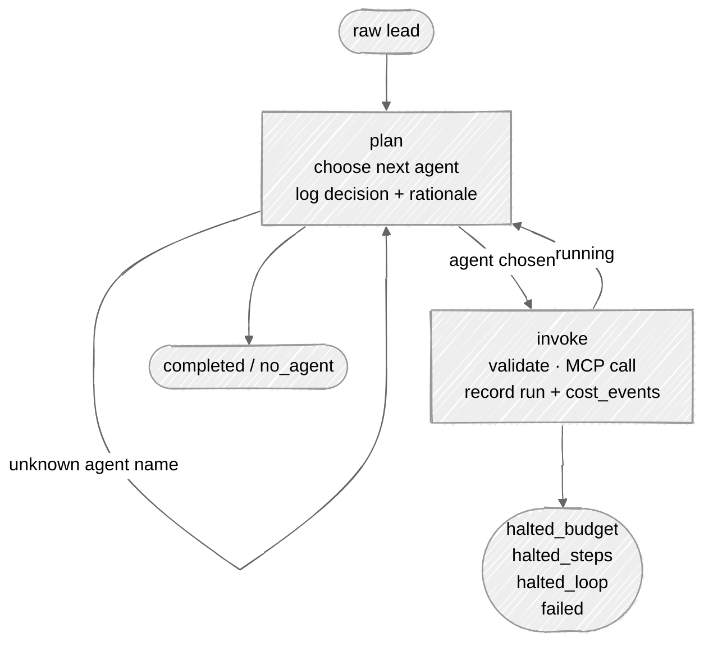

# NexusGTM — Architecture

## High-level design

Three properties the diagram is meant to make obvious:

- **`/core` has no arrow into `/departments`.** It works off the registry and MCP
  endpoints, so adding a department is a server plus a `departments.yaml` entry.
- **Cost returns on the dashed arrows.** Agents run in their own processes and hold no
  database handle, so `cost_events` ride back in the tool result.
- **LangSmith hangs off `llm_call` on a dashed edge.** Nothing reads back from it —
  cost is computed in-process from the usage the Responses API returns inline.

## The run loop

The path is chosen per run, not fixed. An invalid payload is a re-plan rather than a
crash, because the planner's action space is every registered agent — it will sometimes
pick one the blackboard cannot yet satisfy.

## At a glance

CRM is a future addition — nothing writes back to it yet.

## The graph as built

The run loop above is the intent; this is the actual LangGraph — two nodes, both
outbound edges conditional.

Guardrails are not a node. `_guardrail_status` runs inside `invoke`, because a status
assigned in an edge function would not survive into the graph's final state.
